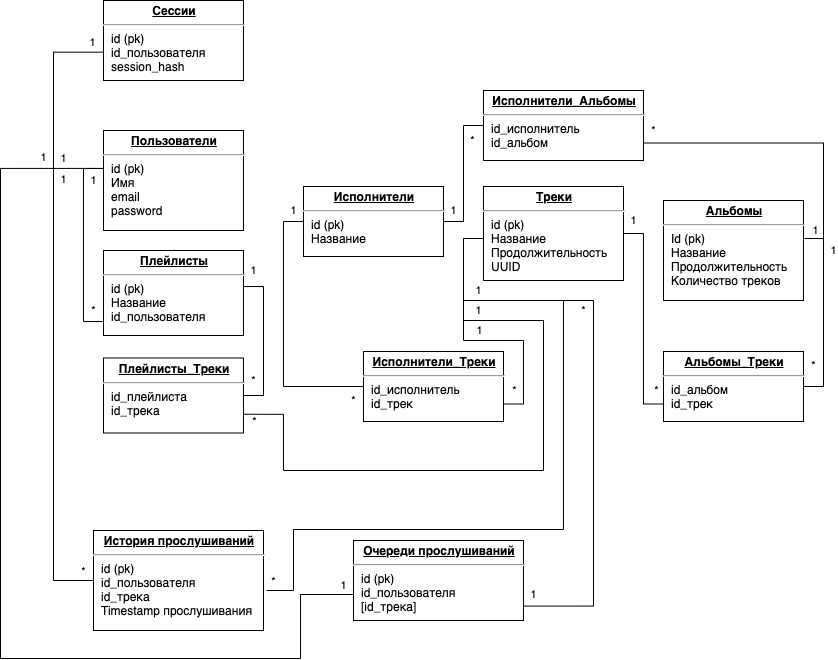

# Домашнее задание №2 Технопарк курс "Проектирование высоконагруженных приложений"
[Общее задание](https://park.mail.ru/blog/topic/view/15123/)

 Выбранная тема - Сервис онлайн прослушивания музыки (like Яндекс.Музыка, BOOM, Spotify)

 -----

1. [Определение возможного диапазона нагрузок проекта](#Определение-возможного-диапазона-нагрузок-проекта)
    * [Оценка аудитории](#Оценка-аудитории)
    * [Оценка нагрузки](#Оценка-нагрузки)
2. [Выбор планируемой нагрузки](#Выбор-планируемой-нагрузки)
3. [Логическая схема базы данных](#Логическая-схема-базы-данных)
4. [Физические системы хранения](#Физические-системы-хранения)
5. [Выбор прочих технологий](#Выбор-прочих-технологий)
6. [Расчет нагрузки и потребного оборудования](#Расчет-нагрузки-и-потребного-оборудования)
7. [Выбор хостинга / облачного провайдера и расположения серверов](#Выбор-хостинга-/-облачного-провайдера-и-расположения-серверов)
8. [Схема балансировки нагрузки](#Схема-балансировки-нагрузки)
9. [Обеспечение отказоустойчивости](#Обеспечение-отказоустойчивости)

## Определение возможного диапазона нагрузок проекта

### Оценка аудитории 
 По данным [Яндекс.Радар](https://radar.yandex.ru/) месячная аудитория Яндекс.Музыки за октябрь составила ~12.5 млн человек, при дневной аудитории в ~2.1 млн человек[[1]](https://radar.yandex.ru/yandex?month=2020-10). Среднее время проведенное пользователем в месяц с учетом кросс-платформенности составляет 7 часов 6 минут.

### Оценка нагрузки

Оценка показателей нагрузки произовдилась на примере [Яндекс.Музыки](https://music.yandex.ru/). Основная нагрузка в сервисе приходится на отправку аудио файлов пользователю. Как среднюю длину одного трека возьмем 4 минуты 10 секунд. *(Данные получены на основе анализа медиатеки автора - плейлист в 1905 треков продолжительностью 132.5 часа)* Размер секунды аудиозаписи при битрейте в `192 Кбит/с` составляет `24 Кб`. Следовательно средний размер аудиозаписи в стандартном качестве *(в сервисе присутствует воспроизведение музыки в высоком качестве)* в сервисе составляет:

`Размер_трека = (4 мин * 60 с + 10 с) * 24 Кб = 6000 Кб ~= 5.86 Мб`

Объем медиатеки сервиса на момент 27 сентября 2017 года составлял более 35 млн треков [[2]](https://www.interfax.ru/business/580802). Хранение 35 млн треков требует как минимум:

`Минимальный_объем_памяти_медиатеки = 35 * 10^6 треков * 5.86 Мб ~= 205 100 000 Мб ~= 195.6 Тб`

Среднее время прослушивания музыки в день у пользователей Яндекс.Музыки составляет 90 минут[[3]](https://rg.ru/2020/03/26/kakuiu-muzyku-predpochitaiut-slushat-rossiiane-na-karantine.html) (5400 секунд). При средней длине трека в 250 секунд, получим среднее количество прослушиваемых треков в день равное 22 трекам. Как было замечено выше у мобильных пользователей потребность в загрузке треков минимальна, поэтому мы можем пренебречь этими данными в следующих расчетах. Тогда дневная аудитория активно нагружающая сервис будет составлять `~1.28 млн человек`. Среднее количество запросов в секунду будет составлять: 

`RPS_загрузка_трека = 1.28 * 10^6 чел * 22 трека / (24 ч * 60 мин * 60 с) ~= 326 rps`

При этом размер трафика будет составлять:

`Трафик_загрузки_трека = 1.28 * 10^6 чел * 22 трека * 5.86 Мб * 8 бит / (24 ч * 60 мин * 60 с) ~= 14.92 Гбит/с`

## Выбор планируемой нагрузки

В качестве предполагаемой нагрузки выбрано значение в 30% от общей доли интернет-пользователей в России. Данная аудитория будет считаться как месячное посещение разрабатываемого сервиса. 

По данным проекта [Web-Index](https://webindex.mediascope.net/) сайта [Mediascope](https://mediascope.net/) количество интернет-пользователей старше 12 лет в России составляет ~95.3 млн человек[[4]](https://webindex.mediascope.net/general-audience). Таким образом потенциальная аудитория сервиса должна составить `28.59 млн человек`. Основываясь на данных Яндекс.Музыки можем предположить, что суточная аудитория сервиса должна составить 17% от месячной или `4.8 млн человек`. 

В расчетах мы не будем делить аудиторию на мобильную и десктопную, предположив использование нашего сервиса на ПК.

Предполагамое среднее количество запросов в секунду должно составить:

`Предполагаемый_RPS_загрузка_трека = 4.8 * 10^6 чел * 22 трека / (24 ч * 60 мин * 60 с) ~= 1222 rps`

Предполагаемый средний трафик в секунду должен составить:

`Предполагаемый_Трафик_загрузки_трека = 4.8 * 10^6 чел * 22 трека * 5.86 Мб * 8 бит / (24 ч * 60 мин * 60 с) ~= 55.94 Гбит/с`

При составленном пользователем заранее плейлисте его основные действия будут состаять в открытии плейлиста и его включении. Данный процесс предположительно требует 4 обращения к API сервиса (загрузка данных пользователя, загрузка плейлистов, загрузка информации плейлиста, загрузка списка треков). Потенциально во время сессии пользователь может захотеть добавить себе несколько треков в аудиотеку. Предположим, что каждый пользователь в течение дня добавляет себе по 4 трека в один из плейлистов. Данный процесс занимает еще предположительно 4 запроса к API(поиск трека/альбома/исполнителя, открытие исполнителя, открытие альбома, добавление трека в плейлист). Исходя из ранее расчитанных данных и полученных выше данных получим среднее количество rps для API:

`API_средний_rps = 4.8 * 10^6 чел * (22+4+4*4) / (24 ч * 60 мин * 60 с) ~= 2400 rps`

Данный показатель в момент пиковой загрузки увеличивать нагрузку на 12 часов (с 10:00 до 22:00) для основной массы пользователей (Европейская часть России - 70% населения). Тогда пиковый rps может достигать:

`API_пиковый_rps = 4.8 * 10^6 чел * 0.7 * (22+4+4*4) / (12 ч * 60 мин * 60 с) ~= 3300 rps`

Пиковый потенциальный трафик:

`Предполагаемый_Пиковый_Трафик_загрузки_трека = 4.8 * 10^6 чел * 0.7 * 22 трека * 5.86 Мб * 8 бит / (12 ч * 60 мин * 60 с) ~= 78.34 Гбит/с`

<!--- 
По расчетам коллеги https://github.com/Howle-Great/Highload-Service-Development было 554 ТБ/час = 157 Гбит/с
При размере контента на пользователя в день = 349 Мб для 2 млн пользователей при условии, что пользователь прослушивает музыку 187 минут в среднем
В нашем случае размер контента при прослушивании 90 минут в день - 128 Мб для 3.36 млн человек, что дает нам полученное выше значение
-->

## Логическая схема базы данных

<!---
Добавить сессии и очереди
Расписать рпс в базу
Диски на CDN
Меньше реплик
-->

Также стоит отметить, что для реализации очереди воспроизведения, ее целесообразно хранить на сервере, что уберет необходимость организации ее хранения на стороне клиента. Так как очередь воспроизведения достаточно динамически изменяющаяся единица, целесообразно вынести ее из общей логики хранения в отдельную структуру.

## Физические системы хранения

Как было обозначено выше для очереди воспроизведения целесообразно выделить отдельный узел, имеющий возможность быстрого обращения. В качестве системы хранения для этого можно использовать Redis. Данная БД хранит данные в оперативной памяти, обладает высокой производительностью на операциях set-get (до 100 тысяч операций в секунду), поддерживает master-slave репликацию. Необходимое значение будет выставляться только при смене трека вне текущего списка воспроизведения, следовательно основной операцией для Redis станет именно get, так как загрузку очереди достаточно выполнить один раз. Рассчитаем объем требуемой памяти для хранения очереди: предположим что пользователь начинает слушать свой большой плейлист (в качестве ориентира взят плейлист автора ~2000 треков). Для хранения необходимы: id пользователя,массив id треков и время последнего прослушивания для выгрузки на диск данных неактивных пользователей. Получим:

`Размер_записи_очереди = (2000 + 1 + 1) * 4 байта = 8008 байта ~= 7.82 Кб`

Тогда для хранения плейлистов в базе ежедневно необходимо:

`Объем_памяти_очереди = 8008 байт * 4.8 * 10^6 человек ~= 3.84 ^ 10^10 байт = 3.6 Гб`

Для поддержания заявленной нагрузки воспользуемся двумя базами для содержания реплики основной активной базы.  

Для хранения сессий пользователя будем использовать Tarantool. 
Так как для каждого действия пользователя необходима проверка на авторизацию (для блокирования функций или изменения, например, прогигрывания рекламы перед треком), расчитаем количество запросов к БД хранения сессий: 1 вход + 1 проверка в профиле + 1 проверка для плейлиста + 22 для треков итого:

`Пиковое_количество_rps_авторизация = 4.8 * 10^6 человек * 0.7 * 25 запросов / (12 ч * 60 мин * 60 с) = 1944 rps`

Тогда для хранения сессий будем использовать 1 инстанс Tarantool с 1 репликой.

Для хранения основных данных сервиса будем использовать PostgreSQL. Рассчитаем объем памяти:

Для данных пользователя (28.59 млн записей):

 ID | Имя(varchar 64) | email(varchar 128) | Пароль(varchar 128) | Итого
 -|-|-|-|-
 4 байта | 256 байт | 512 байт | 512 байт | 1324 байта

 Для данных трека (35 млн треков):

 ID | Название(varchar 64) | Продолжительность(integer 2 байта) | UUID |Итого
 -|-|-|-|-
 4 байта| 256 байт | 2 байта | 16 байт | 318 байта

 Для данных альбомов (Предполагаем, что средний альбом будет содержать 10 треков = 3.5 млн альбомов):

  ID | Название(varchar 64) | Продолжительность(integer 2 байта)  | Количество треков (integer 2 байта)| Итого
 -|-|-|-|-
 4 байта| 256 байт | 2 байта | 2 байта | 304 байта

 Для данных исполнителей (Предполагаем, что у каждого исполнителя около 5 альбомов по 10 треков = 700 000 исполнителей):

  ID | Название(varchar 64) | Итого
 -|-|-
 4 байта| 256 байт | 300 байт

 Для плейлистов прослушивания (2000 треков * 28.59 млн человек = 2.9 млрд записей):

 ID | ID_трека | ID_пользователя | Итого
 -|-|-|-
 8 байт | 4 байта | 4 байта | 16 байт

 Для таблиц реализущих связи многие-ко-многим 16 байт (ID 8 байт + 2xID 4 байта).

 Итоговое количество данных:

`Количество_данных = 28.59 * 10^6 * 1324 байт + 35 * 10^6 * 318 байт + 3.5 * 10^6 * 304 байт + 7 * 10^5 * 300 байт + 2.9 * 10^9 * 16 байт + (7 * 10^5 исполнителей * 50 треков * 16 байт + 7 * 10^5 исполнителей * 5 альбомов + 3.5 * 10^6 альбомов * 10 треков) = 97255660000 байт ~= 91 Гб`

Рассчитаем количество RPS для основной базы данных. По предположению выше каждый пользователь производит добавление по 4 трека в плейлист в течение дня. Тогда RPS на Insert в базу будет:

`Пиковый_RPS_Postgres_Insert = 4.8 * 10^6 человек * 0.7 * 4 запроса / (12 ч * 60 мин * 60 с) ~= 311 rps`

Данные о треках, артистах и альбомах не требуют постоянных изменений. 

Рассчитаем RPS на Select. При аутентификации в сервисе и открытие профиля происходит получение данных пользователя и списка плейлистов (2 запроса). При открытии плейлиста происходит получение списка треков - 1 запрос разбитый пагинацией предположим как по 50 треков в части. Усредним, что каждый пользователь может пролистать плейлист на треть, для 2000 треков получим 12 запросов. При добавлении трека в плейлист должен произойти поиск (1 запрос) или открытие исполнителя (данные исполнтеля + список альбомов = 2 запроса), открытие альбома (данные альбома + список трека = 2 запроса). При этом открытие альбома может происходить не один раз. Усредним данные, предположив, что пользователь добавляет 1 трек с помощью поиска и 3 поиском в данных исполнителя - получим 13 запросов. Итого получим:

`Пиковый_RPS_Postgres_Insert = 4.8 * 10^6 человек * 0.7 * (2+12+13) запросов / (12 ч * 60 мин * 60 с) ~= 2022 rps`

Стоит уточнить, что запрос на поиск является весьма тяжеловесным и будет занимать гораздо больше времени.

Для хранения объема информации, заявленного выше, а также поддержания необходимого количества RPS воспользуемся одной БД с 3 репликами по приницпу master-slave-slave-slave. 

Стоит учитывать постоянное расширение плейлистов пользователей, что может в будущем требовать большего количества пространства, а также потенцилаьного шардирования.

Стоит заметить, что единственной активной единицей в БД является история прослушиваний, обновляемая при каждой загрузке трека. Рассчитаем сколько необходимо хранить данных по истории прослушивания в течение 3 месяцев. Размер записи в таблице: 

 ID | ID_Пользователя | ID_Трека | timestamp_даты_прослушивания
 -|-|-|-
4 байта | 4 байта | 4 байта | 4 байта

Итого 16 байт для одной метки прослушивания пользователем. При средних 22 прослушиваниях в день получим:

`Количество_прослушиваний_в_день = 16 байт * 4.8 * 10^6 человек * 22 песен = 1 689 600 000 байт ~= 1.57 Гб`

Тогда за 90 дней история будет занимать 141.62 Гб, за год - 573 Гб.

Для хранения истории за 90 дней мы можем использовать In-Memory базу к примеру Tarantool с 1 репликой, что позволит ускорить процесс сохранения истории прослушиваний. По истечению срока хранения мы переводим данные в более длительное хранилище.

Данное хранилище исторических данных, применяется для дальнейшего использования информации в целях создания рекомендаций, выстраивания статистики и т.д. Для таких целей хорошо подойдет Clickhouse. Данная БД является колоночной, и создана специально для проведения аналитических запросов.

Для хранения музыкальных треков будем использовать CDN, что позволит создать распределенную сеть обладающую надежностью и высокой доступностью данных для пользователя.

## Выбор прочих технологий

Для разработки фронтенда испольузем JavaScript/TypeScript.

В качестве языка написания бекенда выберем Go, так как язык обладает отличной поддержкой многопоточности, обладает высокой производительностью, при этом за счет широкого выбора библиотек для разных целей, позволяет быстро разрабатывать высоконагруженные и легкоподдерживаемые приложения.

Так как разные элементы сервиса оказываются весьма несбалансированно нагружены по обращениям, разработку будем вести на основе микросервисов. В качестве основного протокола общения микросервисов будем использовать gRPC.

В качестве веб-сервера предоставляющего точку входа выбор был сделан в пользу nginx. Nginx позволяет осуществлять балансировку нагрузку и способен обрабатывать большое количество соединений.

## Расчет нагрузки и потребного оборудования

<!--
cdn - шардируем
максимум скорость отдачи 40 Гбит/с
nginx 1000 rps терминация ssl
резрвируем балансеры
10000-30000 select in-memory
1000-2000 select 100 insert postgres
до 100 rps на ядро для CPU 
 -->

### Нагрузка фронтенда

Средний объем фронтенда составляет `3 Мб` в неархивированном состоянии. При пиковой нагрузке в 70% пользователей с запасом в 30% получим трафик на отдачу фронтенда:

`Максимальный_Трафик_отдачи_фронтенда = 4.8 * 10^6 человек * 0.7 * 3 Мб * 1.3 * 8 бит/ (12 ч * 60 мин * 60 с) ~= 2.36 Гбит/с`

RPS на отдачу фронтенда (при совершении обычных действий может потребоваться около 20 запросов, при учете отсутствия кеширования браузера) в пиковой нагрузке должен составить:

`Фронтенд_пиковый_rps = 4.8 * 10^6 чел * 0.7 * (4+4*4) * 1.3 / (12 ч * 60 мин * 60 с) ~= 2200 rps`

Для данной задачи возьмем сервер с 64ГБ памяти, 32 ядрами процессора и 10G Ethernet. Для выполнения поставленной задачи достаточно 1 сервера, но мы снабдим его репликой на случай отказа (Итого 2 сервера).

### Нагрузка бекенда

Пиковый RPS на бекенд составляет `3300 rps`, что с учетом запаса в 30% составляет `4300 rps`. При предположении о необходимости одного ядра на каждые 100 rps и при конфигурации в 32 ядра на каждый сервер получим, что для обеспечения работы достаточно 2 серверов однако мы возьмем 3 сервера продублировав их репликами, для обеспечения отказоустойчивости.

### Нагрузка на CDN

Пиковый трафик CDN с учетом запаса в 30% должен составлять `~102 Гбит/с`. При этом объем хранимых данных должен составить минимум `195 Тб` для текущей медиатеки + 30% для запаса на добавления новых медиаданных, т.е. `255 Тб`.
Максимальная скорость раздачи, которая мы можем обеспечить это `40 Гбит/с` при оснащении сервера 4 CPU. Для шардирования контента разделим медиатеку на четыре сервера с размером диска в `128 Тб`. Диски формируем путем объединения 16 8 Тб дисков в RAID5 массив. 4 сервера данных снабдим 1 репликой каждый и получим 8 серверов для хранения контента. Каждый кластер из 8 серверов снабдим балансировщиком nginx. Идеальным будет распределить  наши сервера по 3 зонам. Тогда необходимо 24 сервера + 3x2 балансировщика.

### Итоговая конфигурация

 Сервер | CPU | RAM | NET | DISK | Кол-во
 -|-|-|-|-|-
 Redis очереди прослушивания | 16 | 128 Гб | 10Gx1 | RAID1 128 Гб SSD | 2
 Tarantool сесии | 16 | 128 Гб | 10Gx1 | RAID1 64 Гб SSD | 2
 PostgreSQL | 16 | 128 Гб | 10Gx1 | (512ГБ SSD x 4 ) RAID 10 1 Тб SSD | 4
 Tarantool история | 16 | 256 Гб | 10Gx1 | RAID1 128 Гб SSD | 2
 Clickhouse история | 16 | 128 Гб | 10Gx1 | (2ТБ SSD x 4 ) RAID10 = 4 Тб  | 2
 Бекенд | 32 | 128 Гб | 10Gx1 | RAID1 64 Гб SSD | 6
 Фронтенд | 16 | 64 Гб | 10Gx1 | RAID1 128 Гб SSD | 2
 Балансировка | 32 | 64 Гб | 10Gx1 | RAID1 32 Гб SSD | 2 фронт + 2 бек + 6 cdn 
 CDN | 32 | 256 Гб | 10Gx4 | (8ТБ SSD x 16) RAID 5 = 128 Тб| 24

## Выбор хостинга / облачного провайдера и расположения серверов

В качестве облачного провайдера для разворачивания серверов бекенда и фронтенда я решил выбрать MCS, который обладает всем необходимым функционалом для развертывания нашего сервиса, плюс сервера расположены в России. На сайте MCS не оговаривается расположение ДЦ, однако предполагается соединенность всех информационных зон России через оптоволоконную сеть. Если предположить, что основная масса серверов находится в Европейской части России, то это нас устраивает, так как основная часть аудитории (70% как было указано выше) распологается именно здесь.

Для серверов CDN я выбрал расположения в Москве, Санкт-Петербурге и Новосибирске. Для них необходима аренда стоек в датацентрах для обеспечения максимальной скорости отдачи контента.

## Схема балансировки нагрузки

Для выбора ближайшего CDN сервера используем Geo-based DNS технологию, с помощью которой контент будет отдаваться из ближайшего к пользователю ДЦ. Так как в России отсутствуют открытые сревисы для предоставления данной технологии, определение ближайшего CDN сервера можно реализовать на бекенде, храня текущий регион пользователя и проверяя его во время проверки авторизации. После проверки пользователю будет возвращаться адрес входной точки ближайшего CDN сервера.

Внутри каждого кластера CDN используется свой nginx Layer 7 Load Balancing.Данная технология позволяет равномерно распределить нагрузку, позволяет кешировать данные, передавать их в сжатом виде. Nginx сервер обладает встроенными средствами для SSL терминации.

Для балансировки нагрузки на API используем Layer 7 Load Balancing на основе nginx.

## Обеспечение отказоустойчивости

Отказоустойчивость в проекте обеспечивает за счет репликации серверов БД - 2 для Postgres и по 1 для in-memory БД и Clickhouse. Сервер nginx фронтенда дублируется репликой. Формирование серверов API производилось с учетом запаса в 30% от пиковой нагрузки, что позволяет держать в запасе несколько серверов, готовых принять нагрузку в случае отказа нескольких серверов. Также каждый сервер бекенда дублируется репликой. Каждый кластер CDN обладает 2 репликами для каждого шарда.

Отказоустойчивость баланисровщиков обеспечивается сбором метрик, и ручным переключением серверов в случае отказа главного балансировщика. Также возможна реализация сркипта, периодически проверяющего доступность балансировщиков и осущствляющего переключения в автоматизированном режиме в случае отсутствия ответа.